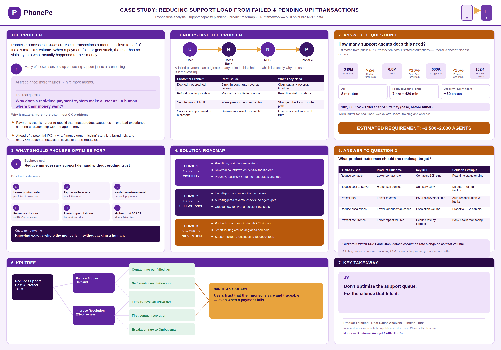

# PhonePe: Reducing Support Load from Failed & Pending UPI Transactions

**A Product Management Case Study**

Root-cause analysis of why failed and pending UPI transactions generate support contacts at PhonePe's scale, and a roadmap for addressing the cause rather than the symptom.

## Full case study

Read it here: [CASE-STUDY.md](./CASE-STUDY.md)

It covers:
- Root-cause breakdown of failed and pending UPI transactions
- Business goals mapped to product outcomes (not features)
- A three-phase solution strategy — visibility, self-service, prevention
- A sourced, assumption-labeled estimate of support agent capacity
- KPI tree, KPI framework, and guardrail metrics
- Cross-functional ownership plan and a validation approach
- Risks, constraints, and a full list of data sources

## Why this problem

PhonePe processes close to half of India's total UPI volume — over 1,000 crore transactions a month. At that scale, even a small failure rate means millions of "where is my money" moments monthly. This case study treats that as a product design problem rather than a staffing problem, and works through it the way I'd want to defend it in an interview: sourced data where it exists, labeled assumptions where it doesn't.

## Author

**Nupur** — Business Analyst / APM candidate, building a portfolio around root-cause product thinking and defensible quantitative reasoning.
